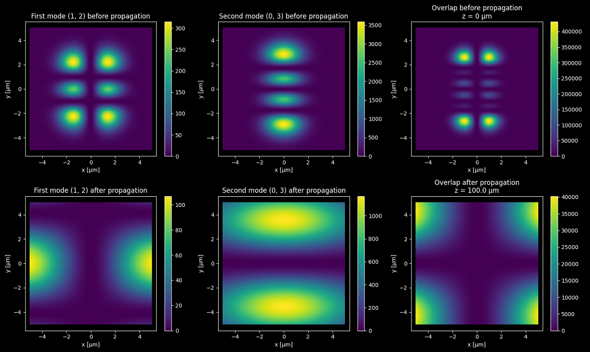

# FFT-based numerical integration method for the Rayleigh–Sommerfeld diffraction formula





This script is a Python implementation of the direct-integration numerical method presented in the following 2006 article 
by Fabin Shen and Anbo Wang:

```
Fast-Fourier-transform based numerical integration method for the Rayleigh–Sommerfeld diffraction formula
doi.org/10.1364/AO.45.001102
```

This article discusses the propagation and diffraction of light in an isotropic, homogeneous linear medium. 
More precisely, it covers the numerical calculation of the Rayleigh–Sommerfeld diffraction integral of an 
aperture under normal chromatic plane-wave illumination.


## Article abstract

```
The numerical calculation of the Rayleigh–Sommerfeld diffraction integral is investigated.
The implementation of a fast-Fourier-transform (FFT) based direct integration (FFT-DI) method 
is presented, and Simpson’s rule is used to improve the calculation accuracy. The sampling interval,
the size of the computation window, and their influence on numerical accuracy and on computational complexity
are discussed for the FFT-DI and the FFT-based angular spectrum (FFT-AS) methods.
The performance of the FFT-DI method is verified by numerical simulation and compared with that of the FFT-AS method. 
© 2006 Optical Society of America
```


## Summary

The script computes the transverse profile of a set of 2 Hermite-Gaussian modes of given orders
`(m1, n1)` and `(m2, n2)` after numerical propagation over a given distance `z` in free space.

All the relevant parameters for the input modes are parsed from a human-readable `.ini` configuration file. 
The configuration filename is specified as a command line argument. The config file parameters are as follows:

```
m1  = 1         # 1st HG mode order 1
n1  = 3         # 1st HG mode order 2
m2  = 2         # 2nd HG mode order 1
n2  = 3         # 2nd HG mode order 2
w0  = 2         # Beam waist [µm]
lam = 0.5       # Wavelength [µm]
N   = 257       # Sampling number in the aperture plane
as  = 10        # Aperture square side [µm]
z   = 100       # Propagation distance [µm]
```

## Quick start


From the command line, run:

```
python propagation.py parameters.ini
```

Either place the config file in the current folder or specify its full path.

An option to animate the propagation plot is available via: 

```
python propagation.py parameters.ini --animate-True
```

Tested on Windows and Python 3.8 only.