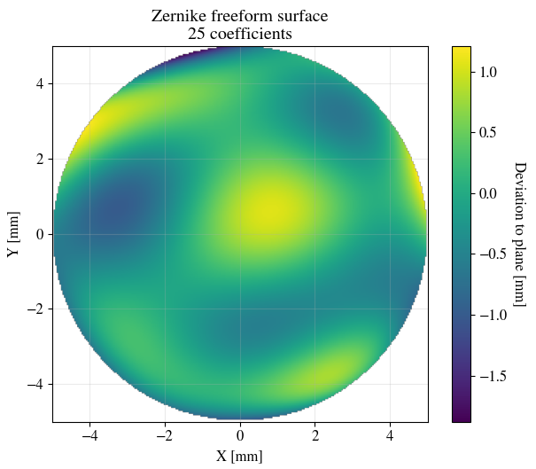

# Zernike freeform surfaces creation and visualization

This script allows to create Fringe Zernike surfaces, defined as a base conic + Zernike departure, and visualize them.
Additionally, surface derivative and surface normal are computed, as these quantities are usefull in ray-tracing software. 
